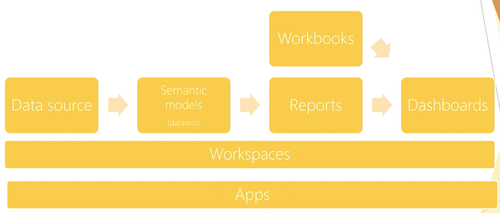
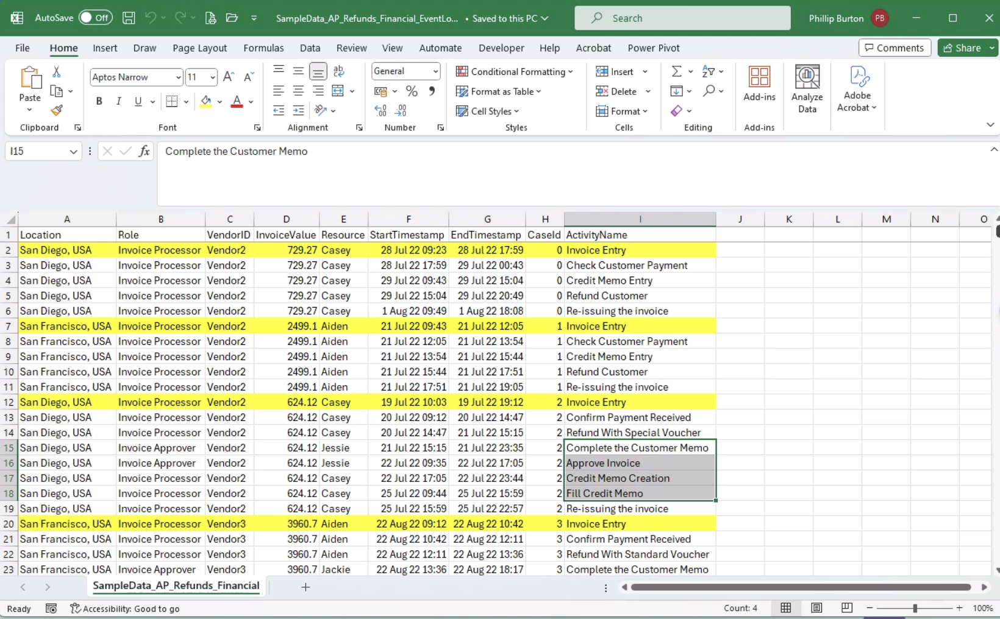
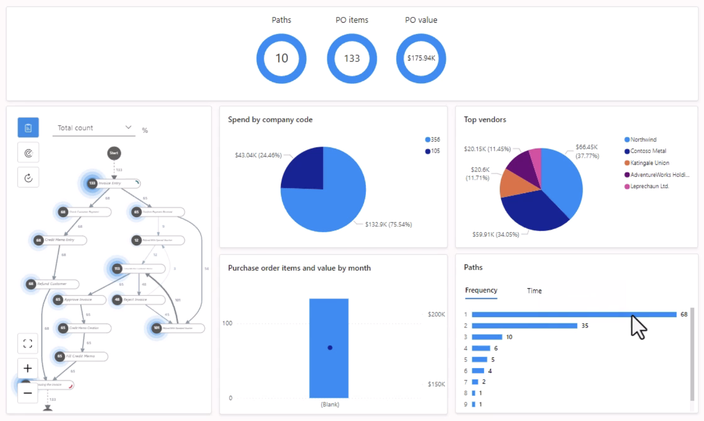

# power-platform-learning
### Power BI Service Terminology

## Power Apps
- **Workspaces**: Is more for collaborating with the team
- **Apps vs Workspaces**: Any change on Workspace will be directly reflected for anyone in Workspace. But apps will reflect the latest version when we publish it.

### Dataverse
- Solutions are like packages to move from one environment to another. E.g when we create PROD environment, we create a solution in dev environment, put things need to copy inside solution and then copy then to production.
- Managed solutions is like locked solution. We can't modify components inside it. It's good for PROD or test environment. When we export a solution, we can define whether it gets exported as managed or unmanaged. But for unmanaged, we can modify components. Also, when we delete the unmanaged solution, only the container (the solution itself) gets deleted, not the inside.
- When we create a table in Dataverse, we can define Ownership:
  - Oragnisation: Then the table will be controlled by oraganisation
  - User or Team: Then data and records in user level
- "Business Roles" is useful when we want to defines some rules on table. Like if field value was "Unkown", change it to something else, if hide it, or don't let to be shown, etc.
- Realtime Workflow and actions are for make the platform do something (like send email, change something, so on) when something happened (like the row changed, record assigned to someone, so on)
  - Find out both these options in: Choose a Solution > New > Automation > Process. 
  - Workflows needs to be attached to a table. Workflow doesn't run on background, you can see it. This is the reason the platform recommends you to use Power Automate instead
  - Actions can be not attached to a table. They run whenever trigger them. Action creates a message whenever gets trigerred. This message can have input and output 
- DataFlaws: Is for get data from a source (like spreadsheet, Azure, so on), Transform it (in Power Query) and then export it.
- If the data is in our machine (like spreadsheet) and we want to setup auto refresh, we should setup a **Gateway**. 
### [Power Apps](https://make.powerapps.com)
- There are 2 types: Canvas apps, Model-driven apps
- "Component" is like components in  ReactJS. We can export components and give them to our colleagues; but they can't edit a component. It's like a blackbox
- Formula can even be used for properties, like Font size, Font style, so on. Just click on the property on the right panel, and change write formula.
- Once you made some changes on a published canvas app, don't forget to publish to new version. For this, we can even right click on the app on apps list > details > versions. And publish the app. We can even restore to previous version from there.

- To create model-driven apps, we either create from:
  - Table Views. and publish them
  - Table Forms. The table should have at least one "main" type form to be able t display as app
    - Main view can even have Canvas app in it.
  - Table Charts. Like Pie charts, so on
  - Table Dashboards. Are combinations of charts and streams (Table views)
- In model-driven create app, try to play with Groups, Navigation bar, Areas, Sub areas, so on.
- Model-driven apps can only use Dataverse as database.
- In Tables, We can import data from many sources, like Spreadsheets. In "Import" wizard, we'll also have PowerQuery to manipulate the data. In progress import, will be displayed in "DataFlows" tab in dashboard.
  - "Import data from Spreadsheet" option adds data to existing flow, but "import data with DataFlows" creates a new table

- Copilot can be used in many Areas in Power Platform. Like
  - on Home screen for planning and creating
  - in Tables to create tables
  - in Apps to create app
  - Even inside the app, you can use Copilot to make changes on the app
  - Even it can use formulas wherever there is a formula

### [Power Automate](https://make.powerautomate.com)
- It is very much like Zapier, but completely integrated to lots of services especially Microsoft services. Like Zapier, Power Automate also has lots of ready to use templates.
- We can share a flow with other person to be able to both edit/run (co-owner) or job view (read only users). We can also send a copy.
- Other than hundreds of connectors (templates), we can create our own custom connector (Like an API). But if we want this connector to be used by people outside our company, we should submit it to get certified by Microsoft (for free).
- Two exciting use case of flows are:
  - **Approval**: Create > Automated cloud flow > When a row added, ... to Dataverse.
    - With this flow, we can create an approval on Dataverse modification. Flow will send approval request email to the managers (or anyone we define)
    There are other approvals in Create>Templates as well.
  - **Business Process Flow**: With this, we can define multi step process when for instance new row added to the table.
    - Solutions on left menu > the solution (like Default) > New > Automation > Process > Business Process Flow .
- Using Desktop version of Power Automate, we can do even more including UI automation (using recorder), like Opening Google sheets, fill the fields, so on.

- We can even ask Copilot (in Home menu of Power Automate) to create Flow for us, and edit it if needed

- **Process Mininig**: This feature (on left menu) creates flows for us to display how the process of somethings goes. For example, how was the process of Customer refund in our DB

- To see use cases of Process Mining, go to Process Mining templates. Cases like:
  - Stream like of activation in Telecommunication
  - Decrease the impact of supply chain in manufacture
  - Identify inefficiency in creating the product and customer service desk
  - Identify ways to reduce works
- In addition, Task Mining can analyse work and suggest improvements

### [Power Pages](https://make.powerpages.microsoft.com)

### [Copilot Studio](https://copilotstudio.microsoft.com)
- With this, we can create AI Agents, like customised ChatGPT. Something that our customers can chat with; Like:
  - Website Q&A
  - Team Navigator (Assist employees to find colleagues)
  - Store Operations
  - Weather assistant
  - Citizen services
  - Personalised benefits agent, so on.

- Duirng agent setup, we can define knowledge base system; Means where this agent should get its additional knowledge from. For example, our website's document, or customer PDFs, so on.

- We can use either templates, or Copilot prompt to create our Agent

### AI Hub

- AI models here are ready to use, and doesn't need programming knowledge
- Allows you to use AI in your Power Apps, even sometimes in Power Automate
- There are lots of ready to use AI models, like:
  - Extract text from images (like bill information)
  - Business card reader
  - Detect objects in a image (like number of cats in the image)
  - Classify customer feedback into predefined categories

- To use AIs in Canvas apps, Model-driven apps or Power Automate, look for "AI Builder" button in any of those services.

### Security

- In Admin Center, there is Security Roles area. We use roles to define access level of teams and users. Like
  - Basic User: Just create apps, add rows, ...
  - Delegate User: Can act on behalf of another user
  - System Administrator: Can to anything
  - System Customizer: Similar to System Administrator, but is allowed to see data in the table you create
  - Environment Admin: Permission to do all administrative actions, including adding users, provision Dataverse, so on
  - Environment Maker: To create Apps, Flows, Gateways, connectors, so on. But not accessing data.

- Data Governance capabilities:
  - Environments (which defines scope), and permissions withing environment
  - DLPs
  - Conditional Access Policies: for block like base on user, location, so on

- Azure Identity Services. Which are 200+ services. We can use them for managing the access to our Power Apps, Power automate, so on. One of them is Azure Active Directory.

**DLP (Data Loss Prevention Policies)**
- We can define them from Platform Admin Center > Data Policies
- DLP helps to prevent companies' data to get publically accessed accidentally. It does this by stricting access to connectors.
- Environment Admin or Tanent Admin can create Data Policies. 
- We can't block Microsoft 365 services, like SharePoint, Dataverse, Notifications, Approvals, Excel, OneDrive.
- During DLP Creation, if we move one connector (like Common Data Source) to "Business" group, it stops the data being shared with connectors in "Non-Business" group, or in other words a connector from "Business" group can't connect to connector from "Non-business" group. Because for example we don't want our data in CDS be shared with connectors in other group.
- When we move a connector to "Blocked" group, means "don't use this connector"

### Settings

- "Power Platform Admin Center" is for setup accesses (account who has access to what) is for all Power Platform services, including Power Apps, Power Automate, so on
  - We can even see analytics here, like tables usages, capacities, so on.
  - Even Data Integration
  - Billings and other settings
- 